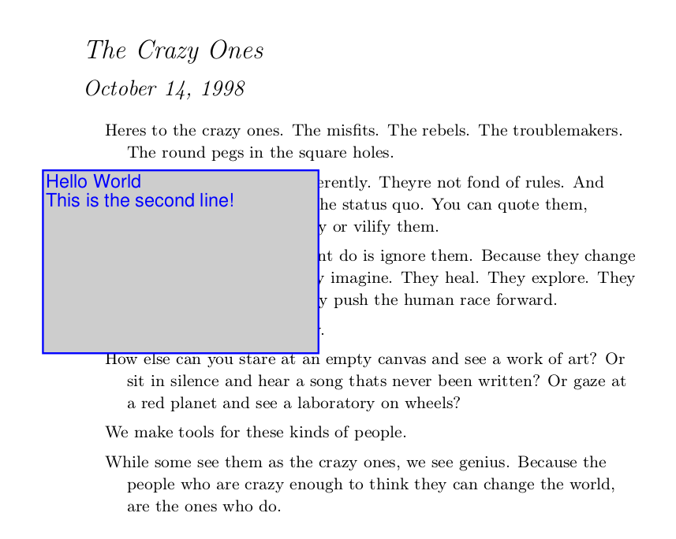
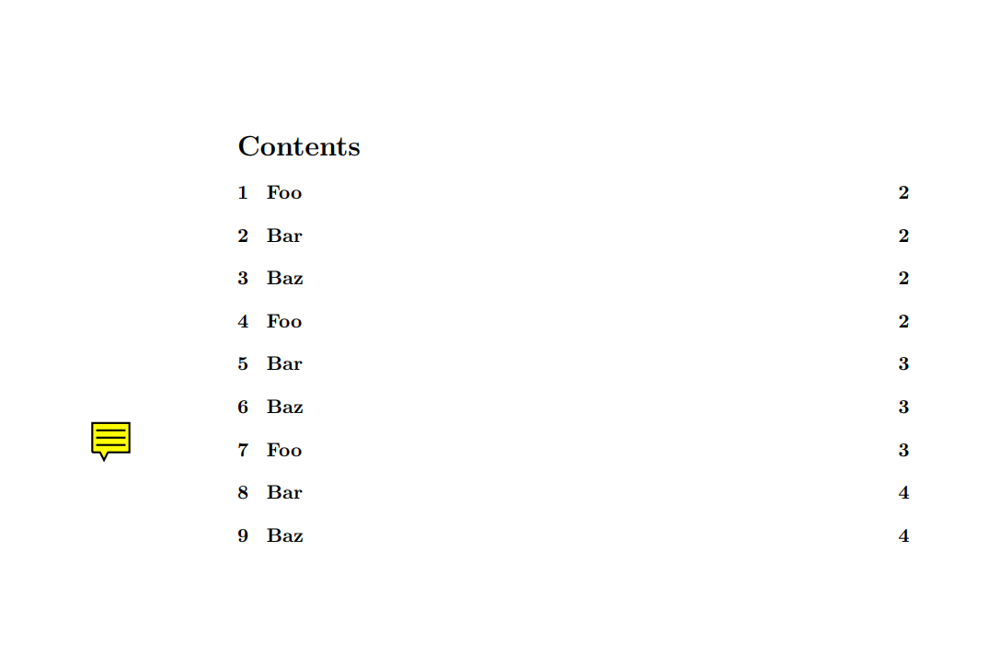
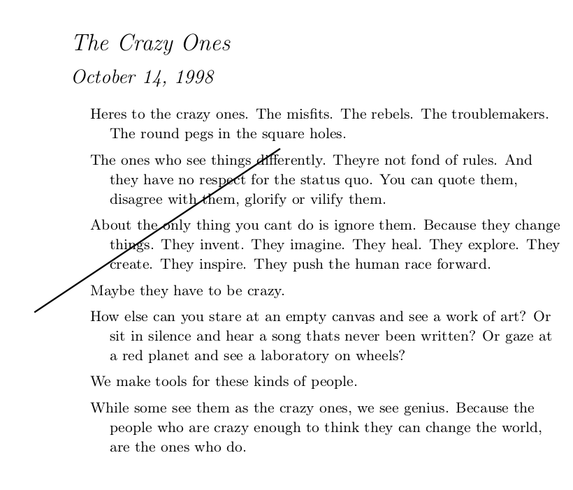
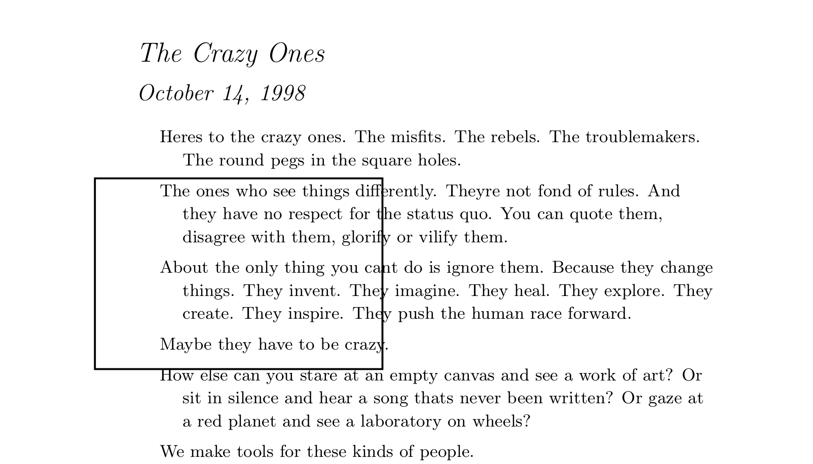

# Adding PDF Annotations

## Attachments

```python
from pypdf import PdfWriter

writer = PdfWriter()
writer.add_blank_page(width=200, height=200)

data = b"any bytes - typically read from a file"
writer.add_attachment("smile.png", data)

with open("output.pdf", "wb") as output_stream:
    writer.write(output_stream)
```


## Free Text

If you want to add text in a box like this



you can use the {py:class}`AnnotationBuilder <pypdf.generic.AnnotationBuilder>`:

```python
from pypdf import PdfReader, PdfWriter
from pypdf.generic import AnnotationBuilder

# Fill the writer with the pages you want
pdf_path = os.path.join(RESOURCE_ROOT, "crazyones.pdf")
reader = PdfReader(pdf_path)
page = reader.pages[0]
writer = PdfWriter()
writer.add_page(page)

# Create the annotation and add it
annotation = AnnotationBuilder.free_text(
    "Hello World\nThis is the second line!",
    rect=(50, 550, 200, 650),
    font="Arial",
    bold=True,
    italic=True,
    font_size="20pt",
    font_color="00ff00",
    border_color="0000ff",
    background_color="cdcdcd",
)
writer.add_annotation(page_number=0, annotation=annotation)

# Write the annotated file to disk
with open("annotated-pdf.pdf", "wb") as fp:
    writer.write(fp)
```

## Text

A text annotation looks like this:



## Line

If you want to add a line like this:



you can use the {py:class}`AnnotationBuilder <pypdf.generic.AnnotationBuilder>`:

```python
pdf_path = os.path.join(RESOURCE_ROOT, "crazyones.pdf")
reader = PdfReader(pdf_path)
page = reader.pages[0]
writer = PdfWriter()
writer.add_page(page)

# Add the line
annotation = AnnotationBuilder.line(
    text="Hello World\nLine2",
    rect=(50, 550, 200, 650),
    p1=(50, 550),
    p2=(200, 650),
)
writer.add_annotation(page_number=0, annotation=annotation)

# Write the annotated file to disk
with open("annotated-pdf.pdf", "wb") as fp:
    writer.write(fp)
```

## Rectangle

If you want to add a rectangle like this:



you can use the {py:class}`AnnotationBuilder <pypdf.generic.AnnotationBuilder>`:

```python
pdf_path = os.path.join(RESOURCE_ROOT, "crazyones.pdf")
reader = PdfReader(pdf_path)
page = reader.pages[0]
writer = PdfWriter()
writer.add_page(page)

# Add the rectangle
annotation = AnnotationBuilder.rectangle(
    rect=(50, 550, 200, 650),
)
writer.add_annotation(page_number=0, annotation=annotation)

# Write the annotated file to disk
with open("annotated-pdf.pdf", "wb") as fp:
    writer.write(fp)
```

If you want the rectangle to be filled, use the `interiour_color="ff0000"` parameter.

This method uses the "square" annotation type of the PDF format.


## Ellipse

If you want to add a circle like this:


```python
pdf_path = os.path.join(RESOURCE_ROOT, "crazyones.pdf")
reader = PdfReader(pdf_path)
page = reader.pages[0]
writer = PdfWriter()
writer.add_page(page)

# Add the rectangle
annotation = AnnotationBuilder.ellipse(
    rect=(50, 550, 200, 650),
)
writer.add_annotation(page_number=0, annotation=annotation)

# Write the annotated file to disk
with open("annotated-pdf.pdf", "wb") as fp:
    writer.write(fp)
```

## Polygon

If you want to add a polygon like this:


you can use the {py:class}`AnnotationBuilder <pypdf.generic.AnnotationBuilder>`:

```python
pdf_path = os.path.join(RESOURCE_ROOT, "crazyones.pdf")
reader = PdfReader(pdf_path)
page = reader.pages[0]
writer = PdfWriter()
writer.add_page(page)

# Add the line
annotation = AnnotationBuilder.polygon(
    vertices=[(50, 550), (200, 650), (70, 750), (50, 700)],
)
writer.add_annotation(page_number=0, annotation=annotation)

# Write the annotated file to disk
with open("annotated-pdf.pdf", "wb") as fp:
    writer.write(fp)
```

## Popup

Manage the Popup windows for markups. looks like this:


you can use the {py:class}`AnnotationBuilder <pypdf.generic.AnnotationBuilder>`:

you have to use the returned result from add_annotation() to fill-up the

```python
# Arrange
writer = pypdf.PdfWriter()
writer.append(os.path.join(RESOURCE_ROOT, "crazyones.pdf"), [0])

# Act
text_annotation = writer.add_annotation(
    0,
    AnnotationBuilder.text(
        text="Hello World\nThis is the second line!",
        rect=(50, 550, 200, 650),
        open=True,
    ),
)

popup_annotation = AnnotationBuilder.popup(
    rect=(50, 550, 200, 650),
    open=True,
    parent=text_annotation,  # use the output of add_annotation
)

target = "annotated-pdf-popup.pdf"
writer.write(target)
os.remove(target)  # comment this out for manual inspection
```

## Link

If you want to add a link, you can use
the {py:class}`AnnotationBuilder <pypdf.generic.AnnotationBuilder>`:

```python
pdf_path = os.path.join(RESOURCE_ROOT, "crazyones.pdf")
reader = PdfReader(pdf_path)
page = reader.pages[0]
writer = PdfWriter()
writer.add_page(page)

# Add the line
annotation = AnnotationBuilder.link(
    rect=(50, 550, 200, 650),
    url="https://martin-thoma.com/",
)
writer.add_annotation(page_number=0, annotation=annotation)

# Write the annotated file to disk
with open("annotated-pdf.pdf", "wb") as fp:
    writer.write(fp)
```

You can also add internal links:

```python
pdf_path = os.path.join(RESOURCE_ROOT, "crazyones.pdf")
reader = PdfReader(pdf_path)
page = reader.pages[0]
writer = PdfWriter()
writer.add_page(page)

# Add the line
annotation = AnnotationBuilder.link(
    rect=(50, 550, 200, 650), target_page_index=3, fit="/FitH", fit_args=(123,)
)
writer.add_annotation(page_number=0, annotation=annotation)

# Write the annotated file to disk
with open("annotated-pdf.pdf", "wb") as fp:
    writer.write(fp)
```
